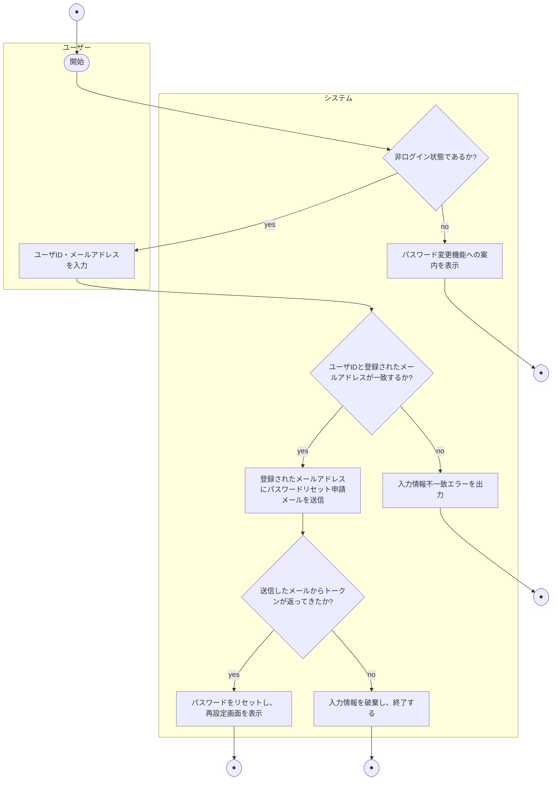

# markdown_tmp
Mermaid記法を用いたUMLのテスト置き場です

## アクティビティ図
### パスワードリセット機能

```mermaid
flowchart TD
    initialNode([●]) --> start

    subgraph ユーザー
        start([開始])
        inputCredentials[ユーザID・メールアドレスを入力]
    end

    subgraph システム
        checkNotLoggedIn{非ログイン状態であるか?}
        showChangePasswordGuide[パスワード変更機能への案内を表示]
        checkEmailMatch{ユーザIDと登録されたメールアドレスが一致するか?}
        sendResetEmail[登録されたメールアドレスにパスワードリセット申請メールを送信]
        showMismatchError[入力情報不一致エラーを出力]
        checkTokenReturned{送信したメールからトークンが返ってきたか?}
        resetPasswordAndShowForm[パスワードをリセットし、再設定画面を表示]
        discardInputAndExit[入力情報を破棄し、終了する]
    end

    start --> checkNotLoggedIn
    checkNotLoggedIn -- yes --> inputCredentials
    checkNotLoggedIn -- no --> showChangePasswordGuide
    showChangePasswordGuide --> endGuide([●])
    inputCredentials --> checkEmailMatch
    checkEmailMatch -- yes --> sendResetEmail
    checkEmailMatch -- no --> showMismatchError
    showMismatchError --> endMismatch([●])
    sendResetEmail --> checkTokenReturned
    checkTokenReturned -- yes --> resetPasswordAndShowForm
    checkTokenReturned -- no --> discardInputAndExit
    resetPasswordAndShowForm --> endSuccess([●])
    discardInputAndExit --> endDiscard([●])
```
