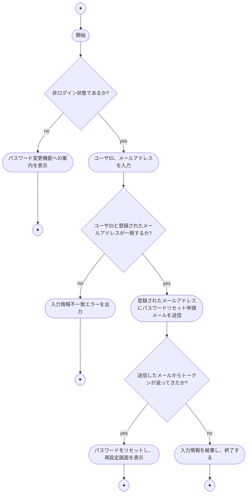

# markdown_tmp
Mermaid記法を用いたUMLのテスト置き場です

## アクティビティ図
### パスワードリセット機能

```mermaid
flowchart TD
    Init([●]) --> A([開始])
    A --> B{非ログイン状態であるか?}

    B -- yes --> C([ユーザID、メールアドレスを入力])
    B -- no --> D([パスワード変更機能への案内を表示])
    D --> End1([●])

    C --> E{ユーザIDと登録されたメールアドレスが一致するか?}

    E -- yes --> F([登録されたメールアドレスにパスワードリセット申請メールを送信])
    E -- no --> G([入力情報不一致エラーを出力])
    G --> End2([●])

    F --> H{送信したメールからトークンが返ってきたか?}

    H -- yes --> I([パスワードをリセットし、再設定画面を表示])
    H -- no --> J([入力情報を破棄し、終了する])

    I --> End3([●])
    J --> End4([●])
```
