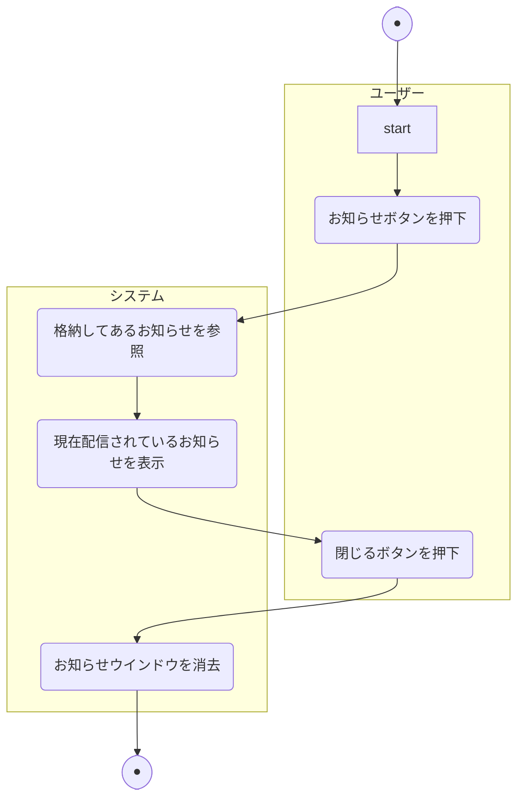

```mermaid

flowchart TD
    initialNode([●]) --> start

    subgraph ユーザー
      start
      pushNoticeButton(お知らせボタンを押下)
      pushCloseButton(閉じるボタンを押下)
    end

    subgraph システム
      connectDBNotice(格納してあるお知らせを参照)
      appearNotice(現在配信されているお知らせを表示)
      deleteNoticeWindow(お知らせウインドウを消去)
    end

start --> pushNoticeButton
pushNoticeButton --> connectDBNotice
connectDBNotice --> appearNotice
appearNotice --> pushCloseButton
pushCloseButton --> deleteNoticeWindow
deleteNoticeWindow --> endNotice([●])
```
